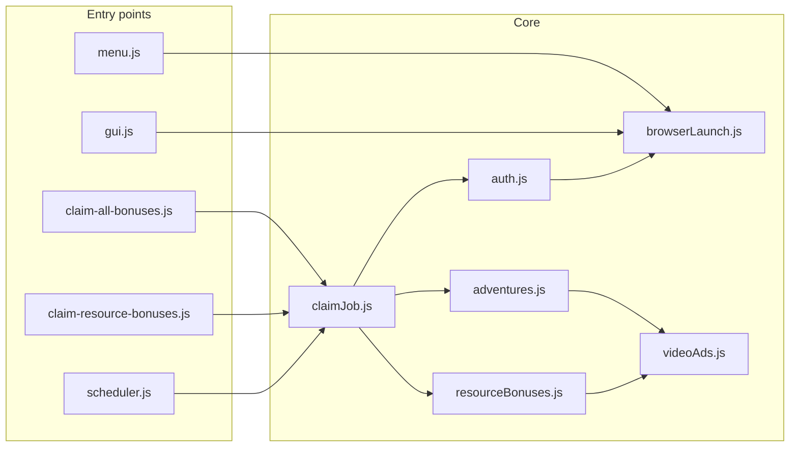

# Architecture

High-level map of **t.bot v0.9.4** (Node.js, CommonJS, Playwright).

## Entry points

| Script | npm command | Role |
|--------|-------------|------|
| `menu.js` | `start` | Interactive CLI menu |
| `gui.js` | `gui` | Express + `public/` web UI |
| `claim-all-bonuses.js` | `bonuses` | One-shot hero + due resources |
| `claim-resource-bonuses.js` | `resources` | One-shot forced resources |
| `scheduler.js` | `schedule` | Loop calling `claimJob.runClaimAllBonuses()` |

## Browser layer

**`browserLaunch.js`**

- `launchBrowser()` — Chromium/Chrome with headless defaults and anti-automation args.  
- `newGameContext()` — viewport, user agent, `navigator.webdriver` override.  
- `launchWithPage()` — convenience for CLI jobs.

The GUI keeps one `browser` + `context` + `page` and serializes actions with `ActionLock` in `gui.js`.

## Authentication

**`auth.js`** — `loadConfig()`, `saveConfig()`, `login(page)`:

- Navigate to server URL  
- Dismiss cookie banner when present  
- Fill login form with waits  
- Debug artifacts under `debug/` on failure  

## Hero bonuses

**`adventures.js`**

- Open Adventures UI  
- `claimHeroBonus(page, 'time' | 'danger')`  
- `handleAdventures(page)` for batch CLI  
- Uses **`videoAds.waitForVideoToFinish`**

## Resource bonuses

**`resourceBonuses.js`**

- Shop wizard open/close  
- `pollResourceBonuses(page)` — read four boxes  
- `claimResourceBonuses(page, { force })` — batch videos  
- `claimResourceBonus(page, resource)` — single resource  
- State: **`resource-bonus-state.json`**

## Video ads

**`videoAds.js`**

- Wait for `.dialog.videoFeature`  
- Click **Watch video** when shown  
- Play in `#videoArea` or any non-Travian ad iframe  
- Wait until video UI is gone  

## GUI server

**`gui.js`** + **`public/`**

- REST + SSE (`logger.subscribe`)  
- `withSession(name, fn)` wraps all Playwright work  
- Bonus poll cache (~30s) for `GET /api/bonuses/status` when `scope=all`
- `POST /api/quit` → shared `shutdown()` (scheduler, browser, server)  

**`heroStats.js`** — parses `#heroV2` on attributes page.

## Supporting modules

| Module | Role |
|--------|------|
| `paths.js` | `ROOT`, `data/`, `debug/`, config paths; migrates legacy root state files |
| `farmList.js` | Open farm list page, round-robin send by list name |
| `farmListState.js` | `farm-list-state.json`, GUI status, random next-run time |
| `farmListScheduler.js` | Min–max minute wait loop for farm sends |
| `logger.js` | Console + `data/bot.log` + SSE subscribers |
| `utils.js` | `randomDelay()` from config |
| `terminalControl.js` | `status` / `stop` / `run` during tasks |
| `scheduleState.js` | `schedule-state.json` read/write |
| `runState.js` | Last completed bonus string |
| `totals.js` | Persistent claim counters |

## Concurrency rules

- Only **one** Playwright action chain at a time in the GUI (mutex).  
- CLI one-shot jobs own their browser and exit.  
- Do not run two GUIs on the same port; avoid overlapping CLI and GUI against the same account if Travian invalidates sessions (one session per machine is usually enough).

## Extension points

1. New bonus type → new module or functions in `adventures.js` / `resourceBonuses.js`, reuse `videoAds.js`.  
2. New GUI control → `gui.js` route + `public/app.js` + docs in [gui.md](gui.md).  
3. New scheduled task → hook in `scheduler.js` or `claimJob.js` with clear due-state JSON if needed.
