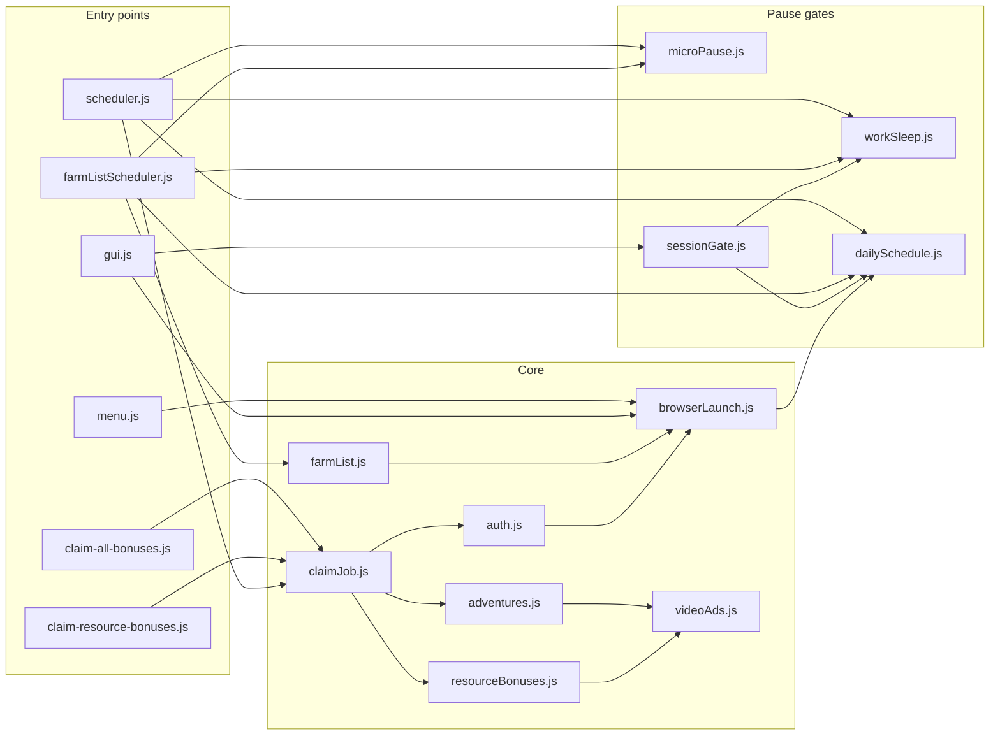

# Architecture

High-level map of **t.bot v0.9.9** (Node.js, CommonJS, Playwright).

```mermaid
flowchart LR
  subgraph entry [Entry points]
    menu[menu.js]
    gui[gui.js]
    bonuses[claim-all-bonuses.js]
    resources[claim-resource-bonuses.js]
    sched[scheduler.js]
    farmSched[farmListScheduler.js]
  end

  subgraph gates [Pause gates]
    ws[workSleep.js]
    ds[dailySchedule.js]
    mp[microPause.js]
    sg[sessionGate.js]
  end

  subgraph core [Core]
    auth[auth.js]
    launch[browserLaunch.js]
    video[videoAds.js]
    adv[adventures.js]
    res[resourceBonuses.js]
    job[claimJob.js]
    farm[farmList.js]
  end

  menu --> launch
  gui --> launch
  bonuses --> job
  resources --> job
  sched --> job
  farmSched --> farm

  sched --> ws
  sched --> ds
  sched --> mp
  farmSched --> ws
  farmSched --> ds
  farmSched --> mp

  sg --> ws
  sg --> ds
  gui --> sg

  job --> auth
  job --> adv
  job --> res
  farm --> launch

  adv --> video
  res --> video
  auth --> launch
  launch --> ds
```

## Entry points

| Script | npm command | Role |
|--------|-------------|------|
| `menu.js` | `start` | Interactive CLI menu |
| `gui.js` | `gui` | Express + `public/` web UI, embedded schedulers |
| `claim-all-bonuses.js` | `bonuses` | One-shot hero + due resources |
| `claim-resource-bonuses.js` | `resources` | One-shot forced resources |
| `scheduler.js` | `schedule` | Loop calling `claimJob.runClaimAllBonuses()` |
| `farmListScheduler.js` | _(GUI only)_ | Farm list min–max timer |

## Pause and session modules

| Module | Role |
|--------|------|
| `workSleep.js` | Random work/sleep phase machine; state in `data/work-sleep-state.json` |
| `dailySchedule.js` | 24× half-hour slots; `proxyPickForNow()` for per-slot proxy |
| `microPause.js` | Random brief pauses between automated runs |
| `sessionGate.js` | `automationWindowAllowed()` — combines work/sleep + daily schedule for browser keep-open policy |

**Gate order** in schedulers: work/sleep → daily schedule → micro pause.

**Browser policy** (GUI): `syncBrowserSessionPolicy()` closes the browser during work/sleep sleep and daily off-hours; reconnects via `ensureSession()` when automation is allowed. Proxy slot changes trigger context restart (`scheduledProxyKey`).

## Browser layer

**`browserLaunch.js`**

- `launchBrowser()` — Chromium/Chrome with headless defaults and anti-automation args.  
- `selectProxyForSession()` — round-robin / random / sticky, or **forced index / direct** from daily schedule.  
- `newGameContext()` — viewport, user agent, optional Playwright proxy.  
- `launchWithPage()` — convenience for CLI jobs.

The GUI keeps one `browser` + `context` + `page` and serializes actions with `ActionLock` in `gui.js`.

## Authentication

**`auth.js`** — `loadConfig()`, `saveConfig()`, `login(page)`:

- Navigate to server URL  
- Dismiss cookie banner when present  
- Fill login form with waits  
- Default config blocks for `workSleep`, `microPause`, `dailySchedule`  
- Debug artifacts under `debug/` on failure  

## Hero bonuses

**`adventures.js`**

- Open Adventures UI  
- `claimHeroBonus(page, 'time' | 'danger')`  
- `handleAdventures(page)` for batch CLI  
- Uses **`videoAds.waitForVideoToFinish`**

## Resource bonuses

**`resourceBonuses.js`**

- Shop wizard open/close  
- `pollResourceBonuses(page)` — read four boxes  
- `claimResourceBonuses(page, { force })` — batch videos  
- `claimResourceBonus(page, resource)` — single resource  
- State: **`resource-bonus-state.json`**

## Video ads

**`videoAds.js`**

- Wait for `.dialog.videoFeature`  
- Click **Watch video** when shown  
- Play in `#videoArea` or any non-Travian ad iframe  
- Wait until video UI is gone  

## GUI server

**`gui.js`** + **`public/`**

- REST + SSE (`logger.subscribe`)  
- `withSession(name, fn)` wraps all Playwright work  
- Bonus poll cache (~30s) for `GET /api/bonuses/status` when `scope=all`
- Config APIs: proxy, schedule, work-sleep, micro-pause, daily-schedule, farm-list  
- `POST /api/quit` → shared `shutdown()` (scheduler, browser, server)  

**`heroStats.js`** — parses `#heroV2` on attributes page.

## Supporting modules

| Module | Role |
|--------|------|
| `paths.js` | `ROOT`, `data/`, `debug/`, config paths; migrates legacy root state files |
| `farmList.js` | Open farm list page; send all checked lists or **Start all** mode |
| `farmListState.js` | `farm-list-state.json`, GUI status, random next-run time |
| `farmListScheduler.js` | Min–max minute wait loop; same pause gates as bonus scheduler |
| `logger.js` | Console + `data/bot.log` + SSE subscribers |
| `utils.js` | `randomDelay()` from config |
| `terminalControl.js` | `status` / `stop` / `run` during tasks |
| `scheduleState.js` | `schedule-state.json` read/write |
| `runState.js` | Last completed bonus string |
| `totals.js` | Persistent claim counters |

## Concurrency rules

- Only **one** Playwright action chain at a time in the GUI (mutex).  
- CLI one-shot jobs own their browser and exit.  
- Do not run two GUIs on the same port; avoid overlapping CLI and GUI against the same account if Travian invalidates sessions (one session per machine is usually enough).

## Extension points

1. New bonus type → new module or functions in `adventures.js` / `resourceBonuses.js`, reuse `videoAds.js`.  
2. New GUI control → `gui.js` route + `public/app.js` + docs in [gui.md](gui.md).  
3. New scheduled task → hook in `scheduler.js` or `claimJob.js` with clear due-state JSON if needed; respect pause gates via `workSleep`, `dailySchedule`, `microPause`.
